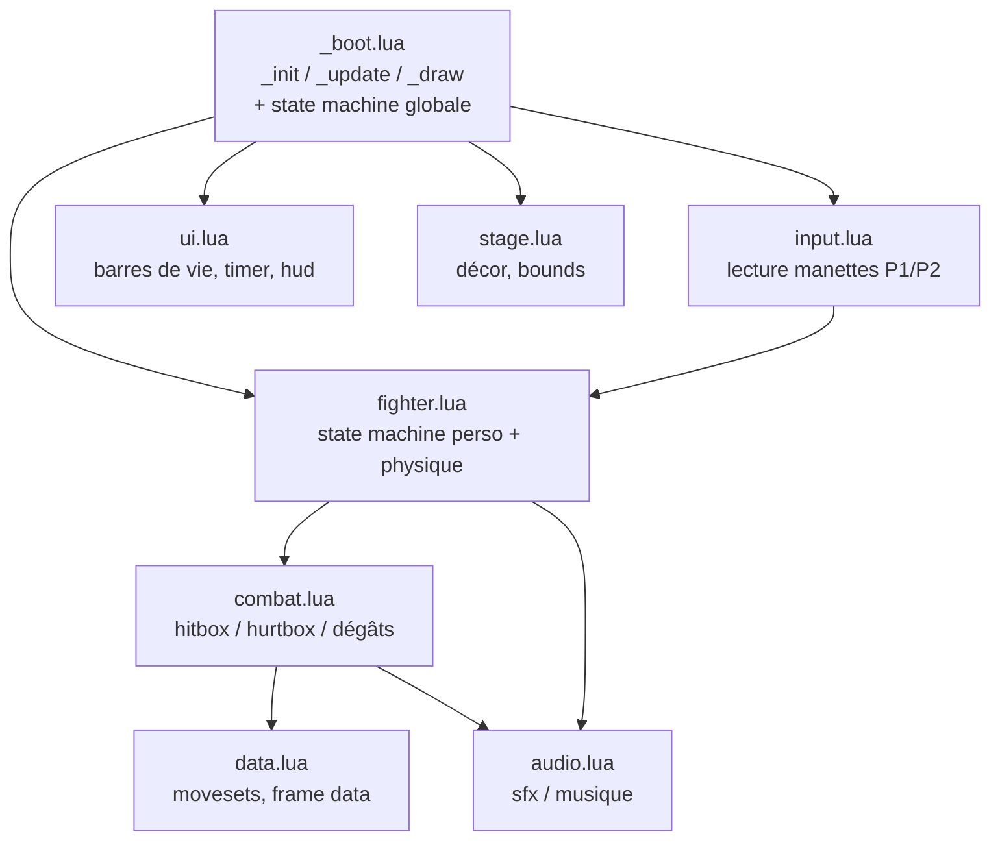
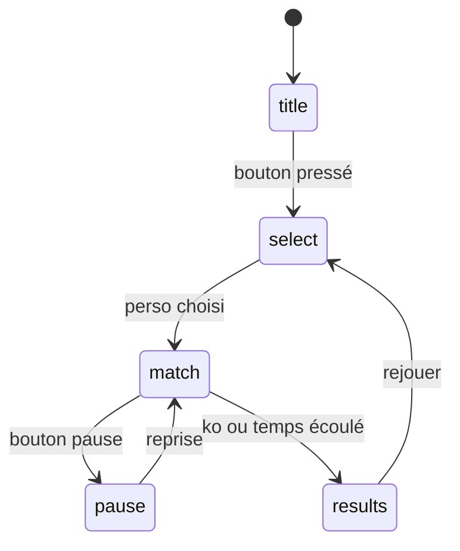

# 🏗️ Architecture de base — Fighting Game PICO-8 (NOH-DEV)

> Structure exploitable en attendant les specs définitives (roster, moveset, direction artistique). Tout ce qui suit est du **squelette fonctionnel** : ça tourne, ça ne fait rien de finalisé, mais la structure ne bougera pas quand tu ajouteras le contenu réel.

---

## 1. Principe de fonctionnement (important)

PICO-8 supporte la directive `#include` : le cart principal (`main.p8`) peut **inclure des fichiers `.lua` externes**, édités dans ton IDE. PICO-8 relit ces fichiers à chaque exécution — tu codes dans ton IDE, tu retournes sur PICO-8, tu tapes `run`, et les changements sont pris en compte sans copier-coller.

⚠️ **Une seule limite** : les sprites, la map, les SFX et la musique ne peuvent **pas** être externalisés — ils vivent dans les sections `__gfx__`, `__map__`, `__sfx__`, `__music__` du `.p8` lui-même, et s'éditent avec les outils intégrés de PICO-8 (touche `Esc` → onglets sprite/map/sfx/music). Le code est modulaire, les assets restent dans le cart.

---

## 2. Arborescence à créer

```
fighting-game-pico8/
├── main.p8              ← cart PICO-8 (header + #include + sections gfx/sfx/map/music)
├── src/
│   ├── _boot.lua         ← orchestration : _init / _update / _draw, machine à états globale
│   ├── input.lua         ← lecture manettes/clavier
│   ├── fighter.lua       ← state machine + physique d'un personnage
│   ├── combat.lua        ← collisions hitbox/hurtbox, dégâts
│   ├── stage.lua         ← décor, limites du terrain
│   ├── ui.lua            ← barres de vie, timer, hud
│   ├── audio.lua         ← déclenchement sfx/musique
│   └── data.lua          ← movesets et frame data (à remplir plus tard)
└── README.md             ← notes de projet
```

---

## 3. Comment créer `main.p8` correctement

Ne pas écrire le fichier `main.p8` à la main de A à Z — les sections `__gfx__` / `__map__` / `__sfx__` / `__music__` ont un format strict que PICO-8 génère lui-même. Procédure :

1. Ouvrir PICO-8, taper `save main.p8` sur un cart vide → ça crée un `main.p8` avec toutes les sections vides mais correctement formatées.
2. Ouvrir `main.p8` dans ton IDE, remplacer le contenu de la section `__lua__` par les `#include` ci-dessous.
3. Créer le dossier `src/` à côté de `main.p8` avec les fichiers listés en partie 2.
4. Revenir sur PICO-8, taper `load main.p8` puis `run` pour tester.

Contenu de la section `__lua__` de `main.p8` :

```lua
__lua__
#include src/_boot.lua
#include src/input.lua
#include src/fighter.lua
#include src/combat.lua
#include src/stage.lua
#include src/ui.lua
#include src/audio.lua
#include src/data.lua
```

Le reste du fichier (`__gfx__`, `__map__`, `__sfx__`, `__music__`) : laisser tel que généré à l'étape 1, tu les rempliras via les éditeurs intégrés de PICO-8 au fur et à mesure.

---

## 4. Diagramme d'architecture



## 5. State machine globale (gérée par `_boot.lua`)



---

## 6. Code de base par fichier

### `src/_boot.lua`
```lua
-- _boot.lua : orchestration principale, appelé par pico-8

game_state = "title" -- title | select | match | pause | results
players = {}

function _init()
 init_input()
 init_stage()
 init_audio()
end

function _update()
 if game_state == "title" then update_title()
 elseif game_state == "select" then update_select()
 elseif game_state == "match" then update_match()
 elseif game_state == "pause" then update_pause()
 elseif game_state == "results" then update_results()
 end
end

function _draw()
 cls()
 if game_state == "title" then draw_title()
 elseif game_state == "select" then draw_select()
 elseif game_state == "match" then draw_match()
 elseif game_state == "pause" then draw_pause()
 elseif game_state == "results" then draw_results()
 end
end

-- stubs à étoffer quand le contenu (menus, roster) sera défini
function update_title() if btnp(4) or btnp(4,1) then game_state="select" end end
function draw_title() print("fighting game proto", 28, 60, 7) end

function update_select() if btnp(4) then start_match() end end
function draw_select() print("select : appuyez sur o", 18, 60, 7) end

function update_pause() if btnp(4) then game_state="match" end end
function draw_pause() print("pause", 50, 60, 7) end

function update_results() if btnp(4) then game_state="select" end end
function draw_results() print("resultats", 40, 60, 7) end

function start_match()
 players = { new_fighter(30, 1), new_fighter(90, -1) }
 game_state = "match"
end

function update_match()
 for p in all(players) do
  read_inputs(p)
  update_fighter(p)
 end
 check_hit(players[1], players[2])
 check_hit(players[2], players[1])
end

function draw_match()
 draw_stage()
 for p in all(players) do draw_fighter(p) end
 draw_hud(players)
end
```

### `src/input.lua`
```lua
-- input.lua : lecture manettes / clavier
-- pico-8 : jusqu'à 8 joueurs, 6 boutons natifs (gauche,droite,haut,bas,o,x)
-- index joueur pico-8 : 0 = p1, 1 = p2

function init_input()
 -- rien à initialiser : la détection manette est automatique côté pico-8
end

function read_inputs(f)
 local idx = f.player_index
 f.input = {
  left  = btn(0, idx),
  right = btn(1, idx),
  down  = btn(3, idx),
  light = btnp(4, idx), -- bouton o : coup léger
  heavy = btnp(5, idx), -- bouton x : coup lourd
 }
end
```

### `src/fighter.lua`
```lua
-- fighter.lua : state machine + physique d'un personnage

function new_fighter(x, facing)
 return {
  x=x, y=96, facing=facing, -- 1 = regarde à droite, -1 = à gauche
  player_index = (facing==1) and 0 or 1,
  state="idle", timer=0,
  health=100,
  hurtbox={x=-4,y=-16,w=8,h=16},
  hitbox=nil,
  input={},
 }
end

function update_fighter(f)
 f.timer += 1

 if f.state=="idle" then
  if f.input.left or f.input.right then f.state="walk"; f.timer=0 end
  if f.input.light then f.state="attack_light"; f.timer=0 end
  if f.input.heavy then f.state="attack_heavy"; f.timer=0 end

 elseif f.state=="walk" then
  local dir = f.input.right and 1 or (f.input.left and -1 or 0)
  f.x += dir * 1.2
  if not (f.input.left or f.input.right) then f.state="idle"; f.timer=0 end

 elseif f.state=="attack_light" then
  update_attack(f, 3, 5, 12) -- valeurs placeholder, à remplacer par data.lua

 elseif f.state=="attack_heavy" then
  update_attack(f, 6, 10, 20)

 elseif f.state=="hitstun" then
  if f.timer > 15 then f.state="idle"; f.timer=0 end
 end

 f.x = mid(8, f.x, 120)
end

function update_attack(f, active_start, active_end, recovery_end)
 if f.timer >= active_start and f.timer <= active_end then
  f.hitbox = {x=8*f.facing, y=-12, w=6, h=6}
 else
  f.hitbox = nil
 end
 if f.timer > recovery_end then f.state="idle"; f.timer=0 end
end

function draw_fighter(f)
 -- placeholder rectangle, à remplacer par spr() une fois les sprites prêts
 rectfill(f.x-4, f.y-16, f.x+4, f.y, f.player_index==0 and 8 or 12)
end
```

### `src/combat.lua`
```lua
-- combat.lua : collisions hitbox / hurtbox et dégâts

function check_hit(attacker, defender)
 if not attacker.hitbox then return end
 local ax = attacker.x + attacker.hitbox.x
 local ay = attacker.y + attacker.hitbox.y
 local dx = defender.x + defender.hurtbox.x
 local dy = defender.y + defender.hurtbox.y

 if rects_overlap(ax, ay, attacker.hitbox.w, attacker.hitbox.h,
                   dx, dy, defender.hurtbox.w, defender.hurtbox.h) then
  defender.health -= 10 -- à externaliser dans data.lua avec les vrais coups
  defender.state = "hitstun"
  defender.timer = 0
  attacker.hitbox = nil -- évite le multi-hit sur une même frame active
  sfx(0) -- son d'impact, index à définir dans l'éditeur sfx
 end
end

function rects_overlap(x1,y1,w1,h1,x2,y2,w2,h2)
 return x1<x2+w2 and x1+w1>x2 and y1<y2+h2 and y1+h1>y2
end
```

### `src/stage.lua`
```lua
-- stage.lua : décor et limites du terrain

function init_stage() end

function draw_stage()
 rectfill(0,0,127,127,1) -- fond placeholder
 line(0,112,127,112,6)   -- sol
end
```

### `src/ui.lua`
```lua
-- ui.lua : barres de vie, timer, hud

function draw_hud(players)
 rectfill(4,4,4+players[1].health,8,8)
 rect(4,4,104,8,7)
 rectfill(124-players[2].health,4,124,8,12)
 rect(24,4,124,8,7)
end
```

### `src/audio.lua`
```lua
-- audio.lua : déclenchement sfx / musique
-- les sons se créent dans l'éditeur sfx intégré pico-8 (esc > onglet sfx)

function init_audio()
 -- music(0) -- à activer une fois un pattern musical créé
end
```

### `src/data.lua`
```lua
-- data.lua : movesets et frame data
-- structure prête, à remplir une fois le roster et les coups définis

movesets = {
 -- [0] = { -- perso p1
 --  light = { startup=3, active=5, recovery=12, damage=10 },
 --  heavy = { startup=6, active=10, recovery=20, damage=18 },
 -- },
 -- [1] = { -- perso p2
 --  ...
 -- },
}
```

---

## 7. Ce qui est volontairement en attente

- **Roster** : `new_fighter()` prend juste x/facing, aucune identité de perso — à étoffer avec un paramètre `character_id` une fois le roster fixé.
- **Movesets** : dégâts et frame data en dur dans `fighter.lua`/`combat.lua` pour l'instant — à migrer vers `data.lua` dès que les coups seront définis.
- **Sprites** : `draw_fighter()` dessine un rectangle, à remplacer par `spr()`/`sspr()` une fois la feuille de sprites prête.
- **Manettes** : gérées nativement (voir réponse ci-dessus), rien à changer dans `input.lua` pour un usage standard 2 boutons.

Cette base tourne telle quelle (deux rectangles qui marchent et se tapent dessus) — c'est voulu, pour valider la chaîne technique avant d'investir sur le contenu.


