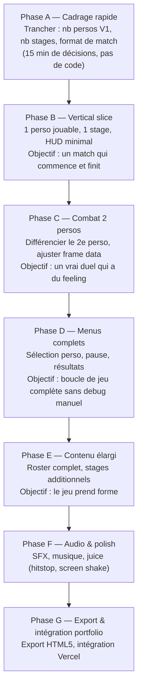

# 🎮 À définir & Guide de création — Fighting Game PICO-8 (NOH-DEV)

> La partie technique (architecture, code de base) est posée. Ce qui reste est du **game design** : des décisions de contenu, pas de nouvelles briques de code. Ce document liste quoi trancher, et dans quel ordre pour ne pas se disperser.

---

## 1. Roster & identité des personnages

- [ ] **Nombre de personnages pour la V1 jouable** (recommandé : 2, extensible ensuite — voir guide en partie 10)
- [ ] **Identité de chaque perso** : nom, style de combat (ex: karatéka rapide, brawler lourd, boxeur technique — tu peux t'inspirer de ton propre vécu Taekwondo pour un des persos)
- [ ] **Archétype de gameplay par perso** — à choisir parmi (ou mixer) :
  - Rush-down : rapide, faible portée, dégâts moyens, pression constante
  - Zoner : lent, longue portée, pénalisé au corps-à-corps
  - Grappler : très lourd, dégâts élevés, mobilité faible
  - All-around : équilibré, pas de faiblesse marquée (bon perso "starter")
- [ ] **Stats de base par perso** : vitesse de déplacement, taille des hurtbox, vie max (uniforme à 100 au départ, ou variable par perso)
- [ ] **Palette couleur par perso** (contrainte : 16 couleurs partagées par tout le cart, donc à répartir consciemment entre les persos + décor)

---

## 2. Kit de coups (moveset) par personnage

Rappel contrainte manette : 2 boutons (O=léger, X=lourd) + directions. Les coups se différencient par **combinaison direction+bouton**, pas par nombre de boutons.

- [ ] **Liste des coups minimum pour un perso jouable** (recommandé pour la V1, 4 à 6 coups) :
  - Coup léger neutre (sol)
  - Coup lourd neutre (sol)
  - Coup bas (bas+léger ou bas+lourd)
  - Coup aérien (saut+bouton)
  - *Optionnel* : un coup spécial (ex: double-tap avant+bouton, ou séquence simple)
- [ ] **Frame data par coup** : startup / active / recovery / dégâts / knockback — la table est déjà prête dans `data.lua`, il ne reste qu'à remplir les valeurs
- [ ] **Différenciation par perso** : mêmes coups avec des frame data différentes suffit pour une V1 (ex : perso rapide = startup court/dégâts faibles, perso lourd = startup long/dégâts élevés)
- [ ] **Un "signature move" par perso** (optionnel mais fort pour l'identité) — un coup unique qui résume le style du perso

---

## 3. Stages / maps

- [ ] **Nombre de stages pour la V1** (recommandé : 1 seul pour commencer, extensible)
- [ ] **Dimensions du terrain** : largeur du stage en pixels (contrainte écran 128px de large, donc soit le stage tient sur un écran fixe, soit tu ajoutes un scroll caméra)
- [ ] **Murs ou stage ouvert ?** (mur = rebond/coincé en corner, ouvert = juste un sol avec limites invisibles comme dans le prototype actuel)
- [ ] **Thème visuel par stage** — cohérence avec identité NOH-DEV (dark green/cyan) ou thème dédié au jeu (dojo, arcade, urbain...)
- [ ] **Décor animé ou statique** (parallax simple, foule en fond, néons clignotants — reste optionnel, contrainte de tokens à surveiller)
- [ ] **Hazards de stage ?** (pièges, plateformes) — généralement absents d'un fighting game 1v1 classique, à ignorer sauf si tu veux un twist gameplay

---

## 4. Menus & flow UI

- [ ] **Écran titre** : logo/texte, "press start", éventuellement musique de menu
- [ ] **Sélection personnage** : affichage du roster, curseur, confirmation P1 puis P2 (ou simultané)
- [ ] **Sélection stage** (optionnel si stage unique en V1)
- [ ] **HUD de match** : barres de vie (déjà en place), timer de round, noms des persos, indicateur de round gagné
- [ ] **Pause** : reprendre / quitter (déjà en stub)
- [ ] **Résultats** : affichage K.O., vainqueur, rejouer ou retour sélection (déjà en stub)
- [ ] **Écran "Perfect" ou mentions spéciales** (optionnel, cosmétique)

---

## 5. Règles de match

- [ ] **Format de match** : 1 round simple, ou best-of-3 ?
- [ ] **Durée du timer par round** (ex: 60s, 99s — à trancher selon rythme voulu)
- [ ] **Comportement à 0 seconde** : victoire au plus de vie restante, ou double KO si égalité exacte
- [ ] **Vie max** : uniforme (100) ou variable par perso (lié aux archétypes en partie 1)

---

## 6. Audio

- [ ] **Liste des SFX nécessaires** (base déjà identifiée) :
  - Coup qui touche (impact)
  - Coup bloqué
  - Whoosh d'attaque
  - K.O.
  - Décompte / confirmation menu
  - Déplacement curseur menu
- [ ] **Musique** : thème de menu, thème(s) de combat (1 par stage ou 1 générique), jingle de victoire

---

## 7. IA (si mode solo envisagé)

- [ ] **Solo vs IA nécessaire pour la V1, ou 100% local 2 joueurs pour commencer ?**
- [ ] Si oui : comportement minimal suffisant pour un premier jet — approche/attaque à portée + blocage occasionnel aléatoire (pas besoin de complexité, une IA "réactive" simple donne déjà un bon ressenti sur PICO-8)

---

## 8. Systèmes bonus (backlog, à trancher plus tard — pas bloquant pour la V1)

- Système de combo / cancels (enchaîner léger → lourd)
- Garde haute/basse distincte (actuellement un seul état "block" prévu dans l'architecture)
- Barre de jauge spéciale / super move
- Roster élargi au-delà de 2 persos
- Stage select multiple

---

## 9. Guide de création — ordre de travail recommandé

Le piège classique sur un projet solo : vouloir tout définir avant de coder. Mieux vaut avancer en **tranche verticale** — un système complet de bout en bout, même minimal, plutôt que tout à moitié fait.

**Pourquoi cet ordre** : la Phase B seule permet déjà de valider si le feel des coups (frame data, hitbox) est bon — c'est le risque principal d'un fighting game. Modifier des chiffres de frame data sur 1 perso est rapide ; le faire découvrir après avoir codé 6 persos et 5 stages coûte cher. Le contenu (roster complet, stages, menus soignés) vient après que le cœur du gameplay soit validé.

---

## 10. Checklist condensée (résumé)

| Domaine | Décision clé | Bloquant pour commencer ? |
|---|---|---|
| Roster | Nombre de persos V1 + identité | Oui |
| Moveset | 4-6 coups par perso + frame data | Oui |
| Stage | 1 stage, dimensions, thème visuel | Oui |
| Menus | Flow minimal (titre → select → match → résultats) | Oui pour boucle complète |
| Règles | Format match, timer, vie max | Oui |
| Audio | Liste SFX + musique | Non (peut venir en Phase F) |
| IA | Solo vs IA ou 2 joueurs uniquement | Non si 2 joueurs suffit pour commencer |
| Bonus | Combos, garde avancée, jauge spéciale | Non, backlog |

---

Prochaine étape concrète : trancher la Phase A (nombre de persos, format de match) pour attaquer la Phase B avec un perso complet.
