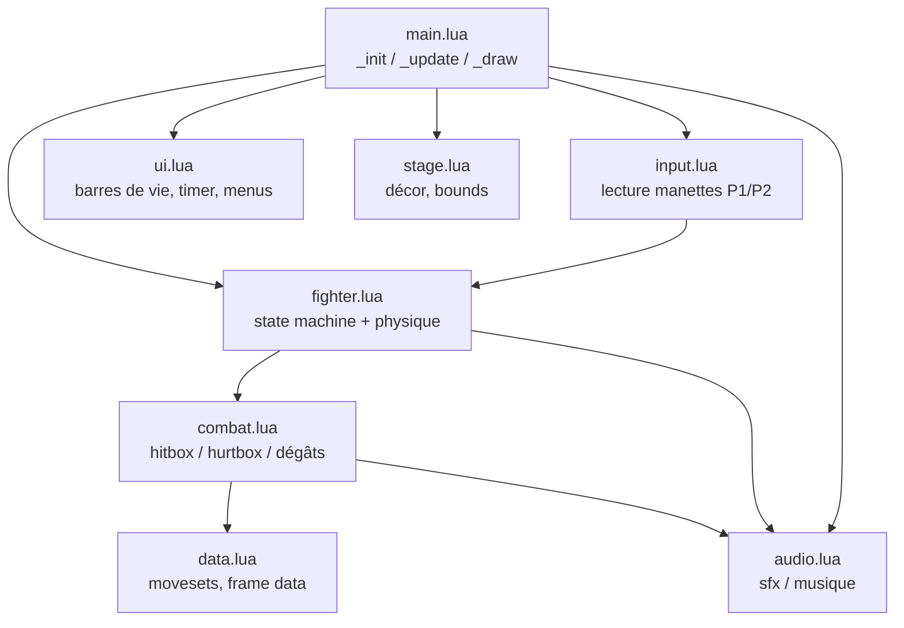
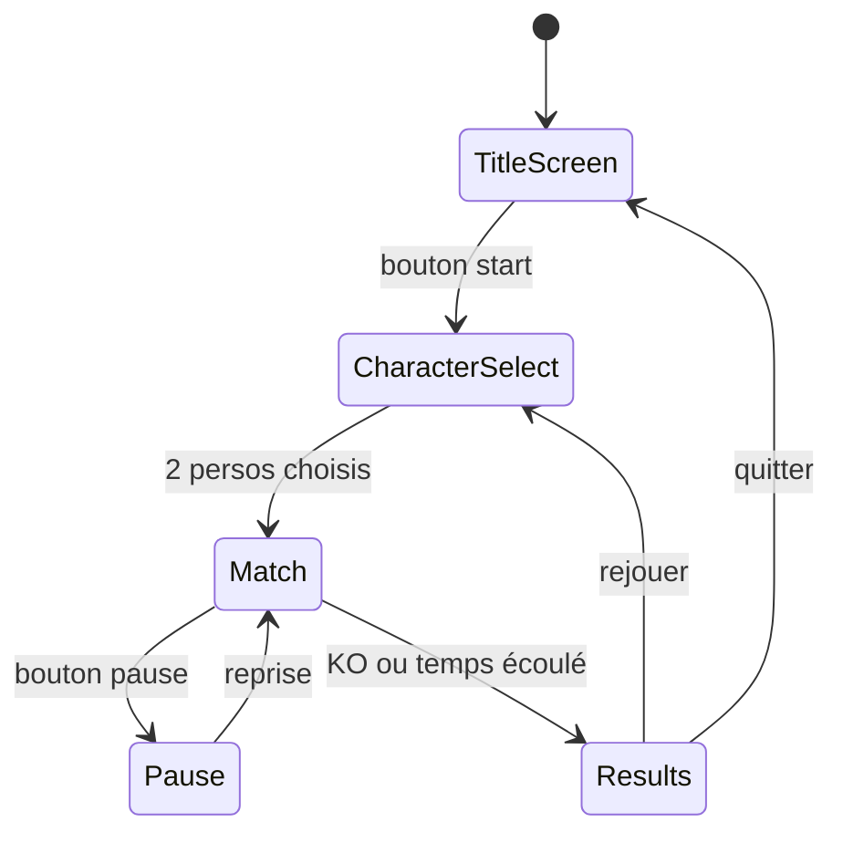
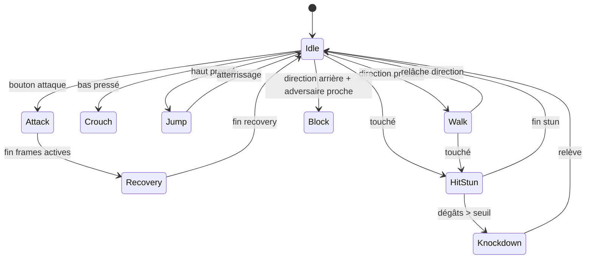

# 🥋 Roadmap Setup — Fighting Game PICO-8 (NOH-DEV)

> Objectif : cadrer tout ce qui doit être en place **avant** d'écrire la première ligne de gameplay. Rien de créatif ici — de la mise en place propre.

---

## 1. Installation & environnement

### 1.1 PICO-8 (obligatoire)
- Achat unique sur [lexaloffle.com](https://www.lexaloffle.com/pico-8.php) (~14,99 $) — dispo Windows/Mac/Linux/Raspberry Pi.
- Une fois installé : lancer `pico8`, vérifier la version avec la commande `version` dans la console intégrée.

### 1.2 Éditeur externe (recommandé, pas obligatoire)
L'éditeur intégré de PICO-8 est correct mais limité (pas d'autocomplete, pas de multi-curseur). Deux options :

| Option | Avantage | Setup |
|---|---|---|
| Éditeur intégré uniquement | Zéro config, tout-en-un | Rien à faire |
| VS Code + extension PICO-8 | Coloration Lua, meilleur confort, diff Git lisible | Installer l'extension "PICO-8" (marketplace VS Code) |

⚠️ **Point clé** : par défaut PICO-8 sauvegarde les carts en `.p8.png` (binaire, image). Pour éditer en externe et versionner proprement, sauvegarder en `.p8` (texte brut) :
```
save mon_jeu.p8
```
Le `.p8` est un fichier texte lisible, éditable dans VS Code, et diffable dans Git.

### 1.3 Git
- `git init` dans le dossier du projet dès le départ, même en solo.
- `.gitignore` : exclure les exports (`.html`, `.bin`) et ne garder que le `.p8` source.

### 1.4 Outils communautaires (optionnels, à garder sous le coude)
- **picotool** (CLI Python, gestion/export/stats de carts) — utile si tu splites le code en plusieurs fichiers à assembler.
- **shrinko8** — compresseur de tokens, à sortir seulement si tu approches la limite (8192 tokens en mode classique [Estimation — vérifier la limite exacte selon ta version PICO-8installée]).

---

## 2. Stack technique

```
Langage        : Lua (moteur intégré PICO-8)
Résolution     : 128x128 px
Palette        : 16 couleurs
Audio          : 4 canaux, 64 SFX, 64 patterns musicaux
Multijoueur    : local uniquement (2 manettes / clavier partagé)
Export cible   : HTML5 (intégration portfolio Vercel) + binaire natif
```

Pas de framework, pas de dépendances externes — tout vit dans le cart PICO-8. La seule vraie décision d'architecture, c'est **comment organiser le code Lua**.

---

## 3. Organisation du code

PICO-8 supporte jusqu'à **8 onglets de code** dans un même cart, séparés par `-->8`. C'est la façon native de modulariser sans outil externe :

```lua
-->8
-- onglet 0 : main / boot
function _init() ... end
function _update() ... end
function _draw() ... end

-->8
-- onglet 1 : fighter (état, physique)
function new_fighter(x, facing) ... end
function update_fighter(f) ... end

-->8
-- onglet 2 : combat (hitbox / hurtbox / dégâts)
function check_hit(a, b) ... end

-->8
-- onglet 3 : input
function read_inputs(p) ... end

-->8
-- onglet 4 : ui (barres de vie, timer, menus)

-->8
-- onglet 5 : stage / décor

-->8
-- onglet 6 : audio / sfx triggers

-->8
-- onglet 7 : data (movesets, frame data des persos)
```

### Schéma d'architecture



---

## 4. Game loop global



---

## 5. State machine d'un fighter

C'est le cœur du gameplay. Chaque perso tourne sur cette machine à états, frame par frame :



Chaque état a 3 phases à prévoir dans les données (frame data) :
- **Startup** : frames avant que le coup devienne actif
- **Active** : frames où la hitbox existe réellement
- **Recovery** : frames de récupération, vulnérable

---

## 6. Convention assets

| Type | Convention | Notes |
|---|---|---|
| Sprites perso | 1 feuille de 8x8 ou 16x16 par état (idle, walk, attaque x3, hit, ko) | Réserver un bloc fixe de sprites par perso dans la sprite sheet PICO-8 |
| SFX prioritaires | whoosh (attaque), impact (touché), block (paré), ko, décompte | 5 sons suffisent pour un premier prototype jouable |
| Musique | 1 thème de combat en boucle, 1 jingle victoire | Pattern PICO-8, pas de fichier externe |

---

## 7. Checklist setup (avant de coder le gameplay)

- [ ] PICO-8 installé et licence activée
- [ ] Choix éditeur (intégré ou VS Code + extension)
- [ ] Repo Git initialisé, `.gitignore` en place
- [ ] Premier cart sauvegardé en `.p8` (texte) et versionné
- [ ] Structure des 8 onglets créée (même vides, avec juste les commentaires d'en-tête)
- [ ] Table de frame data définie sur papier/markdown pour au moins 1 perso (3 coups min)
- [ ] Sprite sheet réservée : blocs alloués pour perso 1 et perso 2
- [ ] Palette de 16 couleurs choisie (cohérente avec ton identité visuelle NOH-DEV, dark green/cyan si tu veux garder la patte portfolio)
- [ ] Export HTML5 testé une fois à vide (`export game.html`) pour valider la chaîne avant d'investir du temps gameplay

---

## 8. Jalons de développement (après ce setup)

1. **Prototype physique** — 1 perso qui marche, saute, reste dans les limites de l'écran
2. **Prototype combat** — hitbox/hurtbox fonctionnelles, un coup qui inflige des dégâts
3. **2 joueurs** — inputs P1/P2, collision entre les deux persos
4. **UI de match** — barres de vie, timer, écran de victoire
5. **Son & polish** — SFX, musique, juice (screen shake, hitstop)
6. **Export & intégration portfolio** — HTML5 embarqué sur `portfolio-noh-dev.vercel.app`

---

## 9. Ressources

- Doc officielle PICO-8 (commande `help` dans la console PICO-8, ou site Lexaloffle)
- BBS Lexaloffle — carts communautaires "fighting" à décompiler pour étudier leur code (tout cart PICO-8 est réouvrable et inspectable)
- Référence design : *Uchu Mega Fight* (fighting game PICO-8 joué en tournoi Evo Japan) — bon exemple de ce qui est atteignable niveau feel
